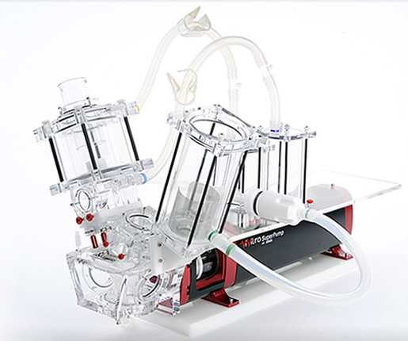
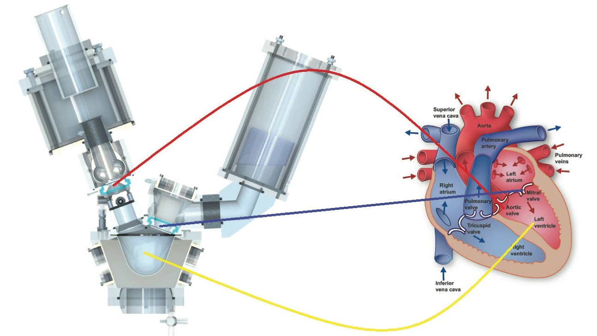

# Описание тестового стенда

В качестве тестового стенда используется аппарат Pulse Duplicator System от Vivitro labs,
изображение которого приведено на рисунке \ref{pds}:

Общая схема стенда и соответствие различных его компонент структуре левого желудочка сердца
представлена на следующем рисунке \ref{pds_and_heart}:

Установка позволяет задавать различные формы давление (аорта, предсердие). 
В качестве жидкости используется салин (0.9% раствок NaCL).
Установка позволяет генерировать поток в диапазоне 2 - 15 л/мин,
и частоту сердцебиения 30 - 220 ударов в минутую
В нормальных условиях аортальное давление варьируется от 80 до 120 мм рт. ст.

В качестве выходных данных может быть получены значения пристеночного давления
рядом с клапанами, расход жидкости, а также проведено прямое наблюдение за работой стенда.

Методика проведения эксперимента предполагает задание параметов, эквивалентных давлению 
здорового человека (см. рис \ref{pressures}), и выполнению нескольких циклов работы
искусственного клапана с получением ряда интегральных характеристик течения жидкости,
в частности расхода жидкости (см. рис \ref{flow_rate}).

В силу конструктивных особенностей, реальный искусственный клапан, используемый в стенде,
является не симметричным. Пример такого клапана приведен на рис \ref{real_valve}:

