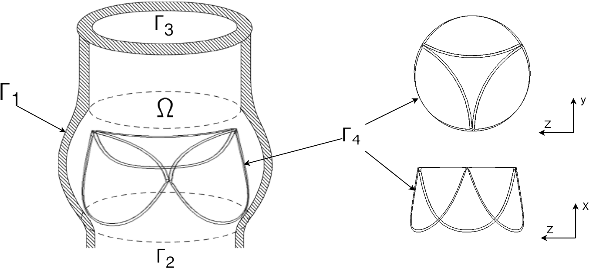

# Постановка задачи и математическая модель

Искусственные сердечные клапаны являются одними из самых сложных
аппаратов, применяемых в кардио-хирургии, т.к. существует множество факторов,
влияющих на их работу. Помимо этого, они должны удовлетворять
большому количеству условий, для того, чтобы быть безопасными и надежными
в использовании. Одними из самых важных аттрибутов искусственного сердечного клапана,
которые необходимо отразить в математической модели, являются следующие:

* Сложная неоднородная структура крови
* Высокая гибкость и подвижность лепестков клапана, а также их чрезвычайно малая толщина
* Необходимость определять напряжение деформации, возникающее на поверхности клапана в процессе его работы

## Структура крови и ее моделирование

Как известно, кровь состоит на 55% из плазмы и на 45% из форменных элементов, и в совокупности является
неньютоновской жидкость. Однако, как показано в [@whitmore1968rheology], отдельно плазма ведет себя как 
ньютоновская жидкость. При этом, реологические свойства крови очень зависят от скорости сдвига (shear rate),
и для большей части сердечного цикла в артериях и желудочках сердца его величина превышает пороговое значение
$50\; \text{сек}^{-1}$, поэтому кровь может рассматриваться как ньютоновская жидкость.

Используя все выше сказанное, а так же тот факт, что размеры частиц, входящих в форменные элементы
(лейкоциты, эритроциты и проч.) достаточно малы относительно размеров исследуемых сосудов
(например, диаметр эритроцита $\sim 6 \cdot 10^{-9}\text{м}$, а диаметр аорты $\sim 3 \cdot 10^{-2}\text{м}$),
мы будем моделировать кровь как вязкую несжимаемую неоднородную жидкость, состоящую
из двух компонент (главной компоненты - плазмы, и примеси - форменных элементов),
а течение жидкости - с помощью нестационарной системы дифференциальных уравнений Навье-Стокса.

$\label{eq:navier_stokes:motion}
    \frac{\partial \vec{u}}{\partial t} + (\vec{u} \cdot \nabla) \vec{u} = - \frac{1}{\rho} \nabla p + \nabla \sigma + \vec{f}\\
    \label{eq:navier_stokes:continuity}
    \frac{\partial \rho}{\partial t} + \nabla \cdot (\rho \vec{u}) = 0$

с начальными и краевыми условиями:

$\label{eq:navier_stokes:velocity_conditions}
    \vec{u}(\bar{x}, 0) = \vec{u}_0 \qquad \vec{u}|_{\Gamma_1, \Gamma_4} = \vec{u}_b \qquad u_{\Gamma_2, \Gamma3} = 0\\
    \label{eq:navier_stokes:pressure_conditions}
    p_{\Gamma_2} = p_{in} \qquad p_{\Gamma_3} = p_{out}$

где $\bar{x}=(x,y,z) \in \Omega$,
$\vec{u}=(u,v,w)$ - вектор скорость, $u, v,
w$ - $x$-, $y$-, $z$-компонента вектора скорости,
$\vec{u}_b$ - скорость движения лепестков клапана под воздействием деформации,
$\rho=\rho(\bar{x}, t)$ - плотность,
$p=p(\bar{x}, t)$ - давление,
$\sigma = \mu (\nabla \vec{u} + (\nabla \vec{u})^T)$ - вязкий тензор напряжений,
$\mu = \mu(\bar{x}, t)$ - вязкость жидкости,
$\vec{f} = \vec{f}(\bar{x}, t)$ - вектор массовых сил.
Область $\Omega$ представляет собой сосуд с границами
$\Gamma = \Gamma_1 \cup \Gamma_2 \cup \Gamma_3 \cup \Gamma_4$, где
$\Gamma_1$ - стенки кровеносного сосуда,
$\Gamma_2$ and $\Gamma_3$ - области втекания/вытекания,
$\Gamma_4$ - лепестки клапана (см рис. \ref{fig:aorta_valve_scheme}).

Как показано в [@gummel2013motion], для того, чтобы моделировать движение неоднородной жидкости (плазма и примеси), можно
добавить к системе уравнений \ref{eq:navier_stokes:motion}, \ref{eq:navier_stokes:continuity} уравнение переноса концентрации:

$\label{eq:convection} \frac{\partial c}{\partial t} + \vec{u} \cdot \nabla c = 0$

с начальными условиями:

$\label{eq:convection:conditions} c(\bar{x}, 0) = c_0(\bar{x}), \bar{x} \in \Omega$

с краевыми условиями для области втекания:

$\label{eq:convection:conditions} c(\bar{x}, t)|_{\Gamma_2} = c_s(\bar{x}, t)$

и связать переменную плотность и вязкость с концентрацией примеси следующими линейными соотношениями:

$\label{eq:viscosity} \mu = c (\mu_2 - \mu_1) + \mu_1\\ \label{eq:density} \rho = c (\rho_2 - \rho_1) + \rho_1$

Т.о. мы получим математическую модель течения крови, которая отражает ее сложную структуру,
а также позволяет легко расширить это описание для описания большего количества компонент
и более сложных условий зависимости плотности и вязкости от концентрации.

## Моделирование эластичных лепестков клапана

Для того, чтобы построить модель, удовлетворяющую оставшимся требованиям, воспользуемся методом погруженной границы.
Метод погруженной границы используется для описания систем "жидкость-препятствие",
где эластичное препятствие погружено в вязкую несжимаемую жидкость.
Впервые был предложен в работе [@peskin2002immersed] для моделирования механики сердечных клапанов и потока крови в них.
Суть метода заключается в том, что при обтекании какого-либо тела жидкостью,
она испытывает влияние сил по направлению нормали к поверхности тела [@goldstein1993modeling].
Обтекаемое тело также испытывает влияние этих сил с противоположным знаком. Поэтому моделирование обтекания препятствия потоком жидкости возможно
с помощью формирования соответствующего поля внешних массовых сил в уравнении Навье-Стокса.
Это позволяет производить вычисления на простых прямоугольных сетках, которые могут не соответсвовать
геометрии расчетной области, что является одной из основных отличительных особенностей метода.

Данный подход был выбран по следующим причинам:

* возможность задавать сколь угодно тонкие лепестки клапана
* возможность моделировать чрезвычайно эластичные структуры, которые сильно меняют свою геометрию со временем
* легкость совмещения с имеющимся комплексом для расчета течения вязкой несжимаемой жидкости

Под термином "метод погруженной границы" обычно понимают как математическую формулировку,
так и схему для численного решения полученной задачи. "Погруженной границей" в данном контексте
обозначают любое гибкое препятствие, погруженное в жидкость. В данной работе под этим будем подразумевать
стенки кровеносного сосуда, а также лепестки клапана, расположенные внутри.
В дальнейшем, если не указано отдельно, будем описывать его только в применении к эластичным лепесткам клапана,
однако это без изменений может быть применено и к любым другим исследуемым объектам (например, фиброзному кольцу или стенкам кровеносного сосуда).

Существует также множество модификаций этого метода (например, метод погруженного интерфейса,
метод декартовых сеток, метод фиктивных ячеек, метод усеченных ячеек, см. [@mittal2005immersed],
но указаные методы не рассматриваются в данной работе.

Математическую формулировку этого метода и численную схему можно разделить на три раздела:
\begin{itemize}
    \item Моделирование течения вязкой несжимаемой жидкости
    \item Моделирование деформации погруженной границы
    \item Моделирование взаимодействия между жидкостью и погруженной границей
\end{itemize}

Течение вязкой несжимаемой жидкости описывается системой нелинейных дифференциальных уравнений Навье-Стокса
в прямоугольной области $\tilde{\Omega}$, которая включает в себя расчетную область $\Omega$. Погруженная граница представлена в виде
набора упругих безмассовых волокон, имеющих "нейтральную плавучесть" \cite{griffith2012immersed},
расположение которых описано в лагранжевых координатах, а эластичность описана в терминах функционала
энергии деформации. Взаимодействие осуществляется исходя из того, что погруженная граница движется под давлением
жидкости с той же скоростью, что и сама жидкости, а внешние массовые силы в уравнении Навье-Стокса определяются
поверхностным напряжением, возникшим в результате деформации погруженной границы. В следующих разделах
эти задачи будут рассмотрены подробнее.

# Список литературы
