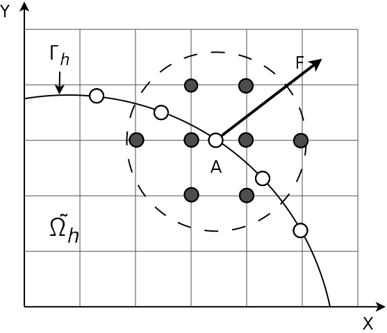

## Численная схема

### Взаимодействие жидкости и погруженной границы

Введем в области $\tilde{\Omega}$ сетку $\tilde{\Omega_h}$ с шагами $h_x, h_y, h_z$, в области $\Gamma$ введем сетку $\Gamma_h$
с шагами $h_q, h_r, h_s$. Как показано в [@peskin2002immersed], численная схема метода погруженной границы,
которая отвечает взаимодействию жидкости и погруженной границы, представлена следующими уравнениями:

$$f(\bar{x}, t_n) = \sum_{\bar{q} \in \Gamma_h}\; F(\bar{q}, t) \; \delta_h (\bar{x} - X(\bar{q}, t)) \; h_q\; h_r\;  h_s$$

$$\frac{dX}{dt}(\bar{q}, t_n) = \sum_{\bar{x} \in \tilde{\Omega_h}}\; u(\bar{x}, t) \; \delta_h (\bar{x} - X(\bar{q}, t)) \; h_x\; h_y\;  h_z$$

Эти уравнения получены из ([@eq:interaction:velocity]), ([@eq:interaction:force]),
путем численного интегрирование с помощью квадратурных формул прямоугольников.
Как показано в [@peskin2002immersed], $\delta$ и $\delta_h$ для любого $X$ должны удовлетворять следующим условиям:

$$\int_{\tilde{\Omega}} \; \delta(\bar{x} - X(\bar{q}, t)) d\bar{x} = 1$$
$$\sum_{\bar{x} \in \tilde{\Omega_h}} \; \delta_h (\bar{x} - X(\bar{q}, t)) h_x\; h_y\; h_z = 1$$

Это означает, что сила в лагранжевых и эйлеровых переменных выражается тождественно:

$\sum_{\bar{x} \in \tilde{\Omega_h}} f(\bar{x}, t)\; h_x\; h_y\; h_z = \sum_{\bar{x} \in \tilde{\Omega_h}} \sum_{\bar{q} \in \Gamma_h} F(\bar{q}, t)\; \delta_h (\bar{x} - X(\bar{q}, t))\; h_q\; h_r\; h_s = \sum_{\bar{q} \in \Gamma_h} F(\bar{q}, t)\; h_q\; h_r\; h_s$

независимо от вида $\delta_h$ (см. аналогичное доказательство для массы, энергии и вращающего момента в [@peskin2002immersed]).

 {#fig:delta_schema}

Выбор вида функции $\delta_h$ является критически важным для описываемого метода. Цель этой функции продемонстрирована на рис. [@fig:delta_schema].
Она определяет то, с каким коэффициентами точки (т.е. насколько сильно) $(x, y, z) \in \tilde{\Omega_h}$ влияют на каждую точку $(q, r, s) \in \Gamma_h$.
Например, на рис. [@fig:delta_schema] на точку $A$ с ненулевым коэффициентом влияют только точки, обозначенные серым цветом.
Для простоты эту функцию можно представить в следующем виде:

$$\delta_h (\bar{x}) = \frac{1}{h_x h_y h_z} \phi \left( \frac{x}{h_x} \right) \phi \left( \frac{y}{h_y} \right) \phi \left( \frac{z}{h_z} \right)$$

Как показано в [@peskin2002immersed], функция $\delta_h$ должна удовлетворять следующим условиям:

1. $\phi(r)$ является непрерывной для всех $r$, что позволяет избежать прижков в скорости или массовой силе, когда точка погруженной границы пересекает границу ячейки в $\tilde{\Omega_h}$ {#sec:delta_conditions:first}
2. $\phi(r) = 0, |r| \geq 2$, т.к. это позволяет снизить количество вычилений, при этом $|r| \geq 2$ является минимальным значением, при котором это условие может быть согласовано с другими {#sec:delta_conditions:second}
3. $\sum_{j \text{чет}} \phi(r - j) = \sum_{j \text{нечет}} \phi(r - j) = \frac{1}{2}$ для всех $r$ - это позволяет удостовериться, что массовые силы/скорость распределяются равномерно {#sec:delta_conditions:third}
4. $\sum_{j} (r - j)\; \phi(r - j) = 0$ для всех $r$, что является необходимым условием для вывода тождественности выражения вращающего момента в лагранжевых и эйлеровых координатах {#sec:delta_conditions:fourth}
5. $\sum_{j} (\phi(r - j))^2 = C$ для всех $r$, что определяет независимость расположения точек на лагранжевой сетке относительно точек эйлеровой сетки {#sec:delta_conditions:fifth}

В [@peskin2002immersed] приводятся два возможных вида $\phi(r)$:

$\phi(r) =$

$$0, r \leq -2$$

$$\frac{1}{8} \left( 5 + 2r - \sqrt[2]{-7 - 12r -4r^2} \right), -2 \leq r \leq -1$$

$$\frac{1}{8} \left( 3 + 2r + \sqrt[2]{1 - 4r -4r^2} \right), -1 \leq r \leq 0$$ {#eq:delta_new}

$$\frac{1}{8} \left( 3 - 2r + \sqrt[2]{1 + 4r -4r^2} \right), 0 \leq r \leq 1$$

$$\frac{1}{8} \left( 5 - 2r - \sqrt[2]{-7 + 12r -4r^2} \right), 1 \leq r \leq 2$$

$\phi(r) =$

$$\frac{1}{4} \left( 1 + cos\left( \frac{\pi r}{2} \right) \right),\qquad ||r|| \leq 2$$ {#eq:delta_old}

$$0 ,\qquad ||r|| \geq 2$$

Формула ([@eq:delta_new]) является немного более сложной, но она удовлетворяет всем условиям 
1-5, в то время как в данной работе
используеся формула ([@eq:delta_old]), которая является более простой, но не удовлетворяет условию 5.

Еще одним важным моментом данного метода является дискретизация по времени уравнения ([@eq:interaction:velocity]),
т.к. явные и полу-явные схемы приводят к необходимости
использовать очень маленький шаг по времени, чтобы добиться лучшей устойчивоти решения (см. например, [@griffith2012immersed]).
В данной работе мы используем метод Адамса-Мультона. Рассмотрим $n$-й шаг по времени, где $t_{n+1}$, $t_n$ - время начала и конца шага,
$\triangle t = t_{n+1} - t_n$, $X_{n+1}, X_n$ - конфигурация погруженной границы в моменты времени $t_{n+1}, t_n$,
$u_{n+1}^{ijk}, u_n^{ijk}$ - скорость жидкости в точке $i,j,k$ в моменты времени $t_{n+1}, t_n$.
Как было показано выше, вначале нашего аглогитма мы находим $u_{n+1}^{ijk}$, решая систему уравнений Навье-Стокса.
Затем нам необходимо определить скорость возмущения погруженной границы из уравнения:

$$\frac{dX}{dt} = f(X, t)$$

где $f(X, t_n) = \sum_{ijk}\; u_{n+1}^{ijk} \; \delta_h(X, i, j, k) \; h_x\; h_y\;  h_z$.
Используя метод Адамса-Мультона 5-го порядка, мы получим:

$$X_{n+1} = X_n + \triangle t \sum_{\lambda=-1}^{k-1} a_{-\lambda} f(X_{n-\lambda}, t_{n-\lambda})$$

где $k=5$, а коэффициенты $a_{1, _{\dots}, k}$ представляют собой набор $\frac{251}{720}, \frac{646}{720}, -\frac{264}{720}, \frac{106}{720}, -\frac{19}{720}$.
Т.к. для применения данной схемы необходимо знать первые $k$ значений функции $f$, для первых $k$ итераций алгоритма
используется аппроксимация первого порядка $X_{n+1} = X_n + \triangle t f(X, t)$. В силу того, что в начале рассчета
еще не возникает сильных деформаций, это не влияет на общую устойчивость описанной схемы.

### Расчет течения жидкости

Уравнения ([@eq:navier_stokes:motion]), ([@eq:convection:conditions]) решаются с помощью метода конечных разностей.
Для решения системы уравнений ([@eq:navier_stokes:motion]), ([@eq:navier_stokes:continuity]) используется схема расщепления
по физическим факторам [@белоцерковский1984численное]:

$$\frac{u^* - u^n}{\triangle t} = - (u^n \cdot \nabla) u^* - \frac{1}{\rho} \nabla \sigma + f^n$$ {#eq:splitting:intermediate_velocity}

$$\rho \triangle p^{n+1} - \nabla \rho \cdot p^{n+1} = \frac{\rho^2 \nabla u^*}{\triangle t}$$ {#eq:splitting:poisson}

$$\frac{u^{n+1} - u^*}{\triangle t} = - \frac{1}{\rho} \triangle p^{n+1}$$ {#eq:splitting:velocity}

Численная реализация данной схемы состоит из трех шагов:

* В начале вычисляется промежуточное поле скоростей $u^*$, для чего методом стабилизирующей поправки [@яненко1967метод] решается уравнение ([@eq:splitting:intermediate_velocity])
* Из ([@eq:splitting:poisson]) численно с помощью метода бисопряженных градиентов определяется новое поле давления
* С помощью ([@eq:splitting:velocity]) вычисляется итоговое поле скоростей

После того, как получены параметры течения, необходимо вычислить новые значения плотности и вязкости. Для этого делается шаг по времени для
уравнения конвекции ([@eq:convection]) и затем вязкость и плотность пересчитываются по формулам ([@eq:viscosity]), ([@eq:density]).
