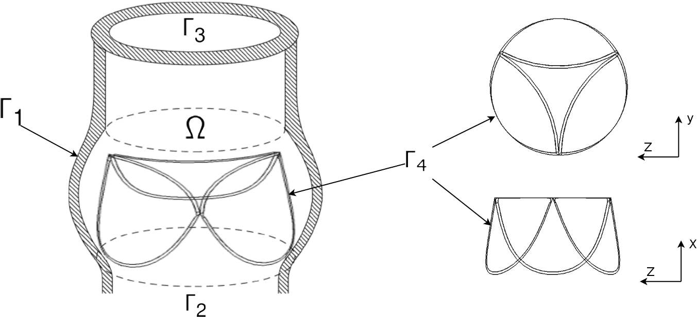

## Постановка задачи

Как известно [@каро1978механика], стенки сосуда и створки клапана состоят из
большого количества коллагеновых волокон, и изменяют свою форму в зависимости
от течения крови. Створки клапана исключительно тонки, их основание крепятся к
жесткому кольцу из фиброзной ткани. Кровь состоит из плазмы и взвешенных в ней
форменных элементов, которые составляют примерно 45% от всего объема и, вообще
говоря, является неньютоновской жидкостью.

 {#fig:heart_scheme}

Размеры форменных элементов очень малы по сравнению с размерами сосуда
(например, диаметр аорты $\sim 3 \cdot 10^{-2}\text{м}$, а диаметр эритроцита
$\sim 6 \cdot 10^{-9}\text{м}$). Это позволяет моделировать кровь как вязкую,
несжимаемую неоднородную двухкомпонентную жидкость с переменной вязкостью.
Стенки сосуда и створки клапана – как непроницаемую для жидкости поверхность,
обладающую некоторой жесткостью. Под воздействием давления жидкости створки
клапана деформируются. Как было сказано выше, кровь является неньютоновской
жидкостью, однако, как показано в [@whitmore1968rheology], отдельно плазма
ведет себя как ньютоновская жидкость. При этом, реологические свойства крови
очень зависят от скорости сдвига (shear rate), и для большей части сердечного
цикла в артериях и желудочках сердца его величина превышает пороговое значение
$50\; \text{сек}^{-1}$, поэтому кровь может рассматриваться как ньютоновская
жидкость.

 {#fig:aorta_valve_scheme}

Так как источником движения крови в сосудах является давление, создаваемое
сокращением сердца, то задачу о ее движении опишем следующей нестационарной
системой дифференциальных уравнений Навье-Стокса [@gummel2013motion]:

$$\frac{\partial \vec{u}}{\partial t} + (\vec{u} \cdot \nabla) \vec{u} = - \frac{1}{\rho} \nabla p + \nabla \sigma + \vec{f}$$ {#eq:navier_stokes:motion}

$$\frac{\partial \rho}{\partial t} + \nabla \cdot (\rho \vec{u}) = 0$$ {#eq:navier_stokes:continuity}

с начальными и краевыми условиями:

$$\vec{u}(\bar{x}, 0) = \vec{u}_0 \qquad \vec{u}|_{\Gamma_1, \Gamma_4} = \vec{u}_b \qquad u_{\Gamma_2, \Gamma3} = 0$$ {#eq:navier_stokes:velocity_conditions}

$$p_{\Gamma_2} = p_{in} \qquad p_{\Gamma_3} = p_{out}$$ {#eq:navier_stokes:pressure_conditions}

где $\bar{x}=(x,y,z) \in \Omega$,
$\vec{u}=(u,v,w)$ - вектор скорость, $u, v,
w$ - $x$-, $y$-, $z$-компонента вектора скорости,
$\vec{u}_b$ - скорость движения лепестков клапана под воздействием деформации,
$\rho=\rho(\bar{x}, t)$ - плотность,
$p=p(\bar{x}, t)$ - давление,
$\sigma = \mu (\nabla \vec{u} + (\nabla \vec{u})^T)$ - вязкий тензор напряжений,
$\mu = \mu(\bar{x}, t)$ - вязкость жидкости,
$\vec{f} = \vec{f}(\bar{x}, t)$ - вектор массовых сил.
Область $\Omega$ представляет собой сосуд с границами
$\Gamma = \Gamma_1 \cup \Gamma_2 \cup \Gamma_3 \cup \Gamma_4$, где
$\Gamma_1$ - стенки кровеносного сосуда,
$\Gamma_2$ and $\Gamma_3$ - области втекания/вытекания,
$\Gamma_4$ - лепестки клапана (см рис. [@fig:aorta_valve_scheme]).

Отсутствие задания одной компоненты вектора скорости на участках
втекания-вытекания является одной из проблем при численном решении задач
подобного типа. Она решается с помощью использования исходных уравнений
([@eq:navier_stokes:motion]) - ([@eq:navier_stokes:continuity]) на границах
$\Gamma_2$ и $\Gamma_3$ для вычисления недостающих компонент вектора скорости
(подробнее см. [@gummel2013motion], [@geidarov2011solution]).

Как показано в [@gummel2013motion], для того, чтобы моделировать движение
неоднородной жидкости (плазма и примеси), можно добавить к системе уравнений
([@eq:navier_stokes:motion]), ([@eq:navier_stokes:continuity]) уравнение
переноса концентрации:

$$\frac{\partial c}{\partial t} + \vec{u} \cdot \nabla c = 0$$ {#eq:convection}

с начальными условиями:

$$c(\bar{x}, 0) = c_0(\bar{x}), \bar{x} \in \Omega$$ {#eq:convection:conditions}

с краевыми условиями для области втекания:

$$c(\bar{x}, t)|_{\Gamma_2} = c_s(\bar{x}, t)$$ {#eq:convection:conditions}

и связать переменную плотность и вязкость с концентрацией примеси следующими
линейными соотношениями:

$$\mu = c (\mu_2 - \mu_1) + \mu_1$$ {#eq:viscosity}

$$\rho = c (\rho_2 - \rho_1) + \rho_1$$ {#eq:density}

Т.о. мы получим математическую модель течения крови, которая отражает ее
сложную структуру, а также позволяет легко расширить это описание для описания
большего количества компонент и более сложных условий зависимости плотности и
вязкости от концентрации.

Для того, чтобы иметь возможность моделировать движение тонких гибких клапанов,
необходимо расширить полученную модель, добавив в нее силы, возникающие при
деформации лепестков клапана и стремящиеся вернуть их в равновесное состояние.
При этом мы можем моделировать стенки сосуда таким же образом, что и клапан,
учитывая при этом, что створки клапана деформируются гораздо сильнее, чем
стенки сосуда.

Для описания сил, возникающих при деформации клапана, воспользуемся
следующей формулой [@peskin2002immersed], [@griffith2012immersed]:

$$F = \frac{\partial}{\partial s} T \tau + \frac{\partial^2}{\partial s} \left( k \cdot \left(\frac{\partial^2 X^0}{\partial s^2} - \frac{\partial^2 X}{\partial s^2} \right) \right)$$ {#eq:resulting_force}

где $k = E \cdot I$, $E$ - модуль упругости, $I$ - момент инерции поперечного
сечения, $\frac{\partial^2 X^0}{\partial s^2}$, $\frac{\partial X}{\partial s^2}$ -
отклонение погруженной границы от равновесного положения в начальный и
текущий момент времени.

Как показано в [@peskin2002immersed], для того, чтобы описать взаимодействие
потока жидкости и клапана, необходимо ввести в рассмотрение
прямоугольную область $(x, y, z) = \bar{x} \in \tilde{\Omega}$, так что $\Omega \in \tilde{\Omega}$,
а также область $(q, r, s) = \bar{q} \in \Gamma$, которая
соответствует точкам клапана в лагранжевых координатах. После
этого, опишем взаимодействи с помощью следующих уравнений:

$$\frac{\partial X}{\partial t}(\bar{q}, t) = \int_{\Omega} \vec{u}(\bar{x}, t) \cdot \delta (x - X(\bar{q}, t))\; d\bar{x}$$ {#eq:interaction:velocity}

$$\vec{f}(\bar{x}, t) = \int_{\Gamma} \vec{F}(\bar{q}, t) \cdot \delta (x - X(\bar{q}, t))\; d\bar{q}$$ {#eq:interaction:force}

где $\delta$ - дельта функция Дирака, $F$ - плотность силы деформации.
Уравнения [@eq:interaction:velocity], [@eq:interaction:force]
и позволяют переходить от эйлеровых к лагранжевым координатам.

Таким образом, мы построили модель, описывающую движение вязкой 
неоднородной несжимаемой жидкости внутри сосуда с клапаном. В этой 
модели состояние жидкости и форма поверхностей $\Gamma_1 \cup \Gamma_4$ определяются 
независимо друг от друга, а влияние створок клапана на течение отражено 
с помощью соотношения ([@eq:interaction:force]) между вектором массовых сил
$\vec{f}(\bar{x}, t)}$ уравнения ([@eq:navier_stokes:motion]) и силой сопротивления
деформации $F=F(\bar{q}, t)$  из уравнения ([@eq:resulting_force]).
