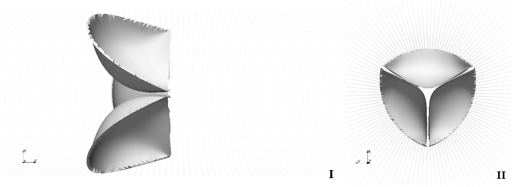
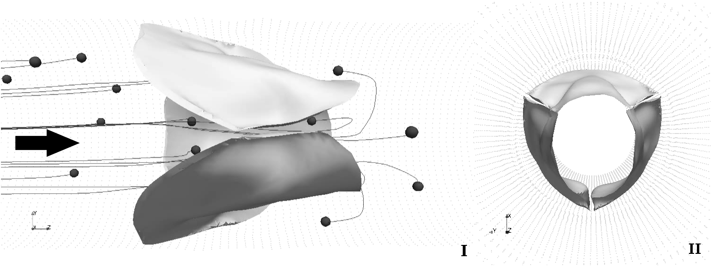
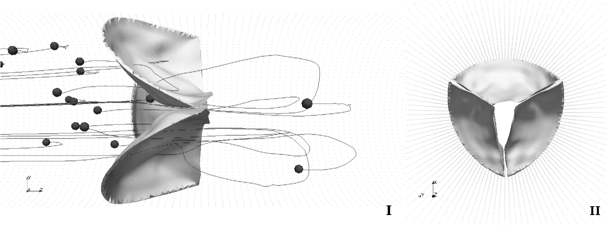
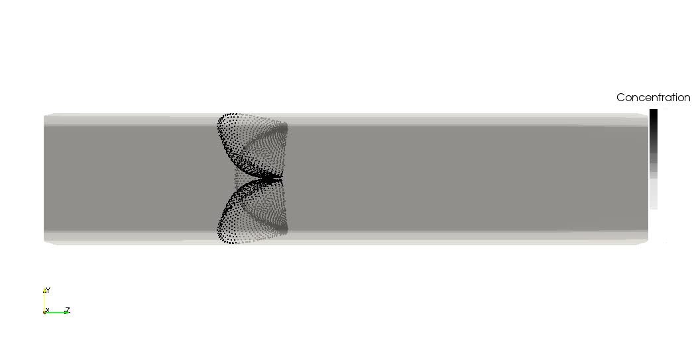
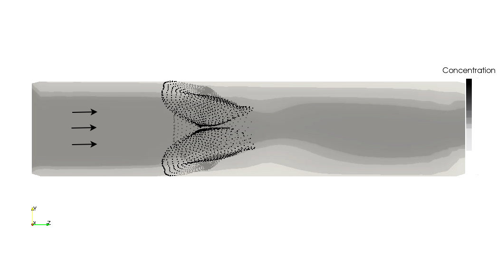
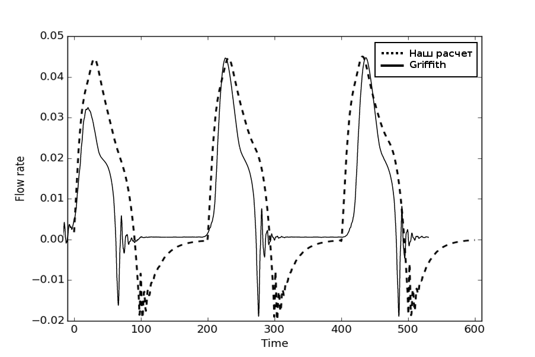

# Верификация и сравнение

В последние годы публикуется все больше работ, в которых представлены результаты тестирования метода погруженной границы,
а также сравнение результатов, полученных для практических задач, с реальными данными. В [@luo2012effect] продемонстрировано
сравнение расчетов течения жидкости в двумерном канале, где часть верхней стенки является гибкой, с помощью метода погруженной границы и
произвольного Лагранжево-Эйлерова метода (Arbitrary Lagrangian-Eulerian Method). Результаты демонстрируют хороший уровень соответвия
(см. рис. [@fig:luo_ale_ibm]).

 {#fig:luo_ale_ibm}

В [@flamini2015immersed] продемонстрировано сравнение некоторых парамеров, полученных в результате расчетов,
с реальными данными, а также с другими работами. Например, объем, перекачиваемый за один удар сердца и пиковый объем
по значениям отличаются от клинических данных [@murgo1980aortic] не более, чем на 15\%, а пиковое давление на стенки
величиной $220kPa$ хорошо совпадают с литературными данными, в частости [@conti2010dynamic]. Параметры лепестков клапа
в этой работе определялись эмпирически, жесткость волокон была равна $7.5 \cdot 10^6 dyne/cm$

Приведем результаты некоторых тестовых расчетов, проведенных в рамках данной работы.

На рис. \ref{fig:valve} показана работа трехстворчатого клапана под воздейтвием давления жидкости с постоянной вязкостью и плотностью
$\rho_1 = \rho_2 = 1$, $\mu_1 = \mu_2 = 1 \cdot 10^{-2}$ и треки некоторых частиц.

 {#fig:valve}

Как можно увидеть из рис. [@fig:valve], лепестки клапана раскрываются при изменении разности давлений, а затем возвращаются в исходное положение при выравнивании давлений.

На рис. [@fig:valve_in_mixture] показана работа трехстворчатого клапана под воздействием давления жидкости с переменной вязкостью и плотностью
$\rho_1 = \rho_2 = 1$, $\mu_1 = \mu_2 = 1 \cdot 10^{-2}$. На $\Gamma_2$ задан постоянный приток примеси $c_s = 0.45$.

 {#fig:valve_in_mixture}

Как видно на рис. [@fig:valve_in_mixture], начальное равномерное распределение примеси нарушается движением лепестков клапана. Итоговое осцилирующее
распределение примеси соответствует циклам работы клапана.

На рис. [@fig:flow_rate] показано сравнение расхода жидкости, соответствующий 3м циклам работы клапана (отмечен точечной линией),
с данными из исследования [@griffith2012immersed] (отмечен непрерывной линией). Несмотря на то, что в данной работе использовались безразмерные величины,
графики демонстрируют качественное сходство. Каждый цикл содержит резкий подъем в начале, затем спад с перегибом и осциляцию в момент закрытия клапана.
Расходы жикости для первого цикла отличаются сильнее, т.к. в [@griffith2012immersed] на первом шаге для клапана задавалось искусственное напряжение.

 {#fig:flow_rate}
